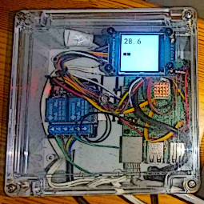

# Sigma Σ

Sigma is a control and monitoring program from IoT realm designed for running on Raspberry PI boards. Program reads-out paramters such as temperature, basing on this does apply a certain actions e.g. cooling fan switch on/off.
It supports LCD diplay, thus user has an easy insight into actual state.



> **CAUTION:**
> 
> **This software controls devices that might need to be powerd directly from mains or perform kinetic actions (motors). It's *your* responsibility to ensure that setup is safe for you and others. If unsure always consult issues with profesional electrician.**

Currently, project supports following features: 
- Control display
- Temperature read-outs
- Relay control

## Logic

The purpose of the device is to perform given action upon occurrence of a certain conditions.

The conditions are defined as: 
### Upper limit: 
- **if** value exceeds `max` **then:** send signal `on`
- **if** value drops below `min` **then:** send signal `off`
### Low limit
- **if** value drops below `min` **then:** send signal `on`
- **if** value exceeds `max` **then:** send signal `off`

At this point only temperature sensors has been implemented and tested. Thus the value can only be temperature. 'Logic' `Upper limit` is used to drive cooling (by swithing on fan), while logic `Low limit` is for heating applications.


## Requirements

1. Raspberry PI Computer, any of models: Zero / 3 / 4 / 5
2. MicroSD card with Raspberry Pi OS, or other Linux distribution supporting GPIO
3. Peripherals (if more, more fun): 
   * SPI LCD/OLED display such as Waveshare 0.96inch - 2.4inch, **NOTE:** tested only with [Waveshare 1.54" LCD](https://www.waveshare.com/wiki/1.54inch_LCD_Module)
   * 1wire DS18b20 temperature sensor
   * One or multiple chanel relay such as [WaveShare RPi Relay Board](https://www.waveshare.com/wiki/RPi_Relay_Board)


## Software Setup
Get, compile code and install: 
```bash

sudo git clone https://github.com/tools200ms/Sigma.git /usr/src/Sigma
sudo make compile install clean -C /usr/src/Sigma
```
### SystemD
If it's systemd distributions do the following:

```bash
# install service
sudo cp /usr/src/Sigma/dist/sigma.service /etc/systemd/system/
sudo systemctl daemon-reload
sudo systemctl enable sigma
sudo systemctl start sigma

# check: 
service sigma status
```
# OpenRC
For OpenRC distros: 
```bash
# install service
sudo cp usr/src/Sigma/dist/sigma-openrc.sh /etc/init.d/sigma
sudo chmod +x /etc/init.d/sigma

sudo rc-update add sigma default
sudo rc-service sigma start

# check: 
service sigma status
```

## Software dependencies

Sigma uses [WiringPI](https://github.com/WiringPi/WiringPi) library for hardware calls.


